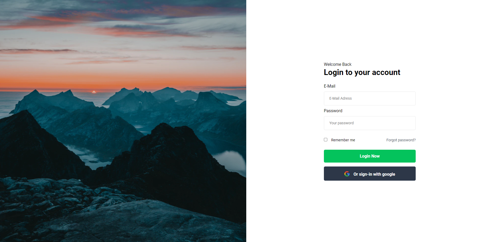

# Simple login form

It's a basic login view inspired by [Daniel's Design Project](https://www.figma.com/community/file/836569395944745131).  
Project was created in vanilla html, NPM package has not initialized.   
**Warning!** In this project, has used SCSS. If you want to continue, you must have SCSS compilator.

## Getting started
In root folder, open `index.html` in your browser.

## Screenshots
